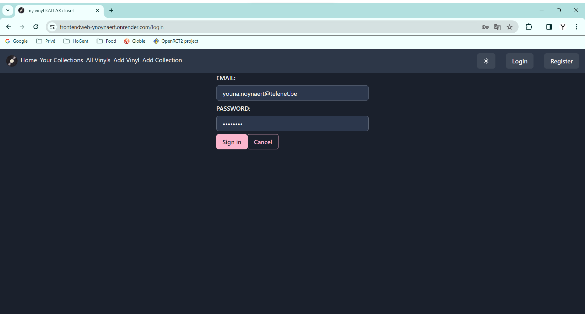

# Youna Noynaert (292179yn)

- [x] Front-end Web Development
  - <https://github.com/Web-IV/2324-frontendweb-ynoynaert>
  - <https://frontendweb-ynoynaert.onrender.com>
- [x] Web Services: GITHUB URL
  - <https://github.com/Web-IV/2324-webservices-ynoynaert>
  - <https://webservices-ynoynaert.onrender.com>

**Logingegevens**

- Admin:
  - Gebruikersnaam/e-mailadres: youna.noynaert@telenet.be
  - Wachtwoord: 12345678

- User:
  - Gebruikersnaam/e-mailadres: youna.noynaert.yn@gmail.com
  - Wachtwoord: 12345678

## Projectbeschrijving

In mijn project kan een gebruiker zijn/haar platencollectie toevoegen. Elke plaat moet in een collectie zitten. Ze kunnen nieuwe platen en collecties toevoegen én hun details aanpassen.

<https://kroki.io/erd/svg/eNpNjsEKgzAQRO_zFZ4VD_2G9iL0VLAXKbLqUkM3iWQTSv--sZba28Bj3kzXKocbSjPBkWWwJSNYSPXpw9TPpDOCF1agO3oRHqPx7q9QpSxoThlfjXvJRihEwxpBMiSLh3AKWIQoNpbu3F7OqMavjHP351jPFIe6Lot9C3vc0GfnDZY9PbE=>

## Screenshots

Dit is de inlogpagina.

Op deze pagina worden alle collecties met de daarin behorende platen getoond.

Dit is de detail pagina van een plaat.

Alle platen die deze gebruiker bezit wordt hier getoond.

Hierop wordt een bestaande plaat aangepast.

Een nieuwe collectie kan ook worden toegevoegd.

Een gebruiker kan zijn naam, email en wachtwoord aanpassen.

## API calls

<http://localhost:9000/swagger>

## Behaalde minimumvereisten

### Front-end Web Development

- **componenten**

  - [x] heeft meerdere componenten - dom & slim (naast login/register)
  - [x] applicatie is voldoende complex
  - [x] definieert constanten (variabelen, functies en componenten) buiten de component
  - [x] minstens één form met meerdere velden met validatie (naast login/register)
  - [x] login systeem
         

- **routing**

  - [x] heeft minstens 2 pagina's (naast login/register)
  - [x] routes worden afgeschermd met authenticatie en autorisatie
         

- **state-management**

  - [x] meerdere API calls (naast login/register)
  - [x] degelijke foutmeldingen indien API-call faalt
  - [x] gebruikt useState enkel voor lokale state
  - [x] gebruikt gepast state management voor globale state - indien van toepassing
         

- **hooks**

  - [x] gebruikt de hooks op de juiste manier
         

- **varia**

  - [x] een aantal niet-triviale e2e testen
  - [x] minstens één extra technologie
  - [x] maakt gebruik van de laatste ES-features (async/await, object destructuring, spread operator...)
  - [x] duidelijke en volledige README.md
  - [x] volledig en tijdig ingediend dossier en voldoende commits

### Web Services

- **datalaag**

  - [x] voldoende complex (meer dan één tabel, 2 een-op-veel of veel-op-veel relaties)
  - [x] één module beheert de connectie + connectie wordt gesloten bij sluiten server
  - [x] heeft migraties - indien van toepassing
  - [x] heeft seeds
         

- **repositorylaag**

  - [x] definieert één repository per entiteit (niet voor tussentabellen) - indien van toepassing
  - [x] mapt OO-rijke data naar relationele tabellen en vice versa - indien van toepassing
         

- **servicelaag met een zekere complexiteit**

  - [x] bevat alle domeinlogica
  - [x] bevat geen SQL-queries of databank-gerelateerde code
         

- **REST-laag**

  - [x] meerdere routes met invoervalidatie
  - [x] degelijke foutboodschappen
  - [x] volgt de conventies van een RESTful API
  - [x] bevat geen domeinlogica
  - [x] geen API calls voor entiteiten die geen zin hebben zonder hun ouder (bvb tussentabellen)
  - [x] degelijke authorisatie/authenticatie op alle routes
         

- **algemeen**

  - [x] er is een minimum aan logging voorzien
  - [x] een aantal niet-triviale integratietesten (min. 1 controller >=80% coverage)
  - [x] minstens één extra technologie
  - [x] maakt gebruik van de laatste ES-features (async/await, object destructuring, spread operator...)
  - [x] duidelijke en volledige README.md
  - [x] volledig en tijdig ingediend dossier en voldoende commits

## Projectstructuur

### Front-end Web Development

Ik heb al mijn API-gerelateerde zaken in een aparte map geplaatst, samen met alle componenten die zich in aparte mappen bevinden. Mijn algemene context staat ook gescheiden. Als laatste zijn mijn pagina's ook elk in een eigen map georganiseerd.

### Web Services

Ik heb alle data-, respository-, rest- en service-gerelateerde zaken in aparte mappen gezet. Ook zitten mijn testen in een aparte map. In de data-map wordt de databank opgezet en ook de nodige tabellen aangemaakt. Hierin wordt dan ook de nodige info aan toegevoegd.
De opstart van dit project bevindt zich ook in een apart document.

## Extra technologie

### Front-end Web Development

De extra technologie is Chakra UI. Chakra UI is een bibliotheek met kant-en-klare bouwstenen (zoals knoppen, invoervelden en meer). Zodat ontwikkelaars tijd kunnen besparen door herbruikbare en aanpasbare componenten te gebruiken.
<https://www.npmjs.com/package/@chakra-ui/react>

### Web Services

De extra technologie is Swagger UI. Swagger UI vereenvoudigt de ontwikkeling van API's door een interactieve manier te bieden om de functionaliteiten van de API te verkennen, te testen en te begrijpen op basis van de OpenAPI Specification.
<https://www.npmjs.com/package/swagger-jsdoc>

## Testresultaten

### Front-end Web Development

De toevoeging en verwijdering van een collectie en plaat worden getest. Ook wordt gekeken of de info van een plaat correct wordt getoond.

### Web Services

In collection en vinyl worden de functies getAll, create, getByID, updateByID en deleteByID. By user worden deze dingen ook getest, maar daar wordt ook getest op register en login.

## Gekende bugs

### Front-end Web Development

Geen gekende bugs.

### Web Services

Mijn EERD is zo gemaakt dat wanneer een collectie verwijderd wordt, ook alle platen die in die collectie zitten verwijderd worden.
